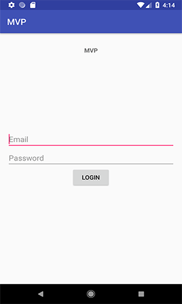
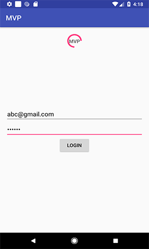
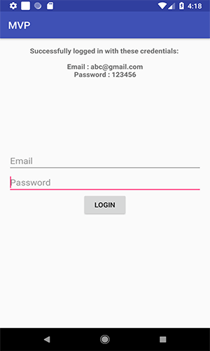

## AndroidMVP
It is a simple MVP android project to understand the basic concept on MVP architecture.

## Prerequisites
Android SDK v28
Latest Android Build Tools
Android Support Repository

## Features

Simple login screen.
- Fake API call for delay
- View interaction with presenter
- Presenter interaction with View/Model

## Description

- MainActivity implements MainActivityPresenter.View and overrides these methods.

        public interface View {
          void updateLoginResponse(String response);
          void clearInputFeilds();
          void showProgressBar();
          void hideProgressBar();
        }
                
- You can add any dummy credentials on login screen to proceed View communicates to presenter.

        private MainActivityPresenter presenter = new MainActivityPresenter(this);
        presenter.loginAPICall("email", "password");  
   after calling this there would be a dummy loader for fake API call (see MainActivityPresenter class) and return response to View. 
   
       mainActivityView.updateLoginResponse("Successfully logged in with these credentials: \n\n" + user.toString());
       mainActivityView.clearInputFeilds();
       mainActivityView.hideProgressBar();

# [Architecture used](https://github.com/googlesamples/android-architecture "Architecture used")

### Dependencies used

    //App's dependencies
    implementation 'com.android.support:appcompat-v7:28.0.0'

### Presenter class for communication

    public class MainActivityPresenter {
    private User user;
    private View mainActivityView;

    public MainActivityPresenter(View mainActivityView) {
        this.user = new User();
        this.mainActivityView = mainActivityView;
    } 

    public void loginAPICall(String email, String password) {
        user.setEmail(email);
        user.setPassword(password);

        //Do API call here, I am adding dummy loader/for delay
        mainActivityView.showProgressBar();

        new CountDownTimer(3000, 1000) {

            public void onTick(long millisUntilFinished) {
            }

            public void onFinish() {

                mainActivityView.updateLoginResponse("Successfully logged in with these credentials: \n\n" + user.toString());

                mainActivityView.clearInputFeilds();
                mainActivityView.hideProgressBar();
            }
        }.start();
    }
      public interface View {

         void updateLoginResponse(String response);

          void clearInputFeilds();

         void showProgressBar();

         void hideProgressBar();
      }
    }

## How to run a sample
- Clone or download the project open it with Android Studio compile and run it will work.

### Images
 
 
 

## Author
[Waheed Nazir (GreenProLogix)](https://www.linkedin.com/in/waheed-nazir-36521579/ "Waheed Nazir (GreenProLogix)")

## License
It is totally free to use. :)
